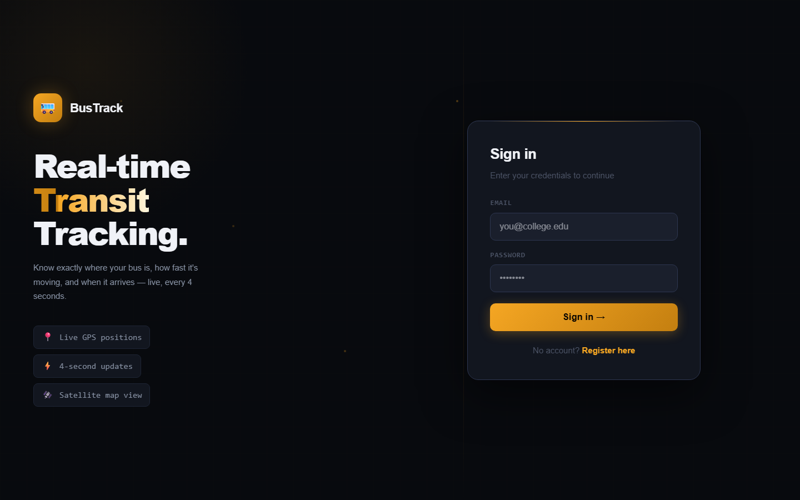
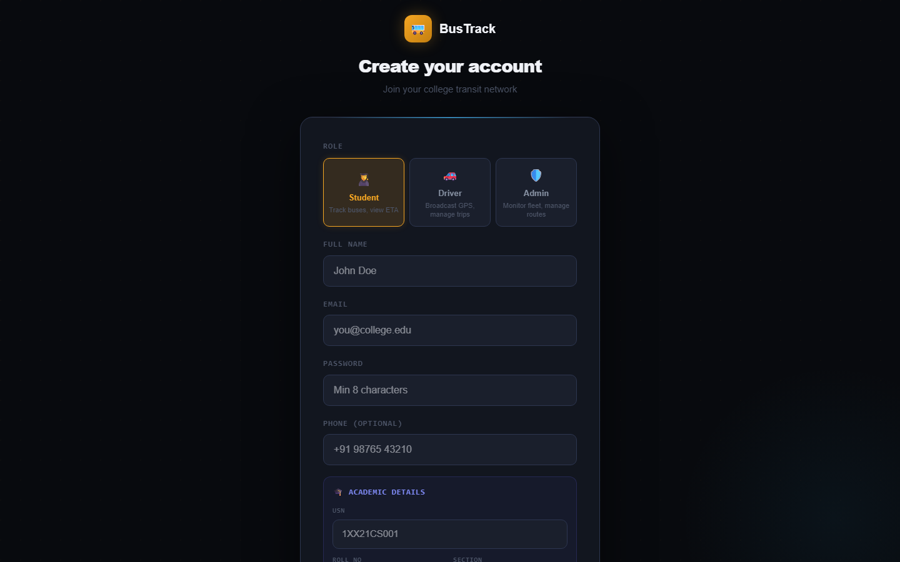
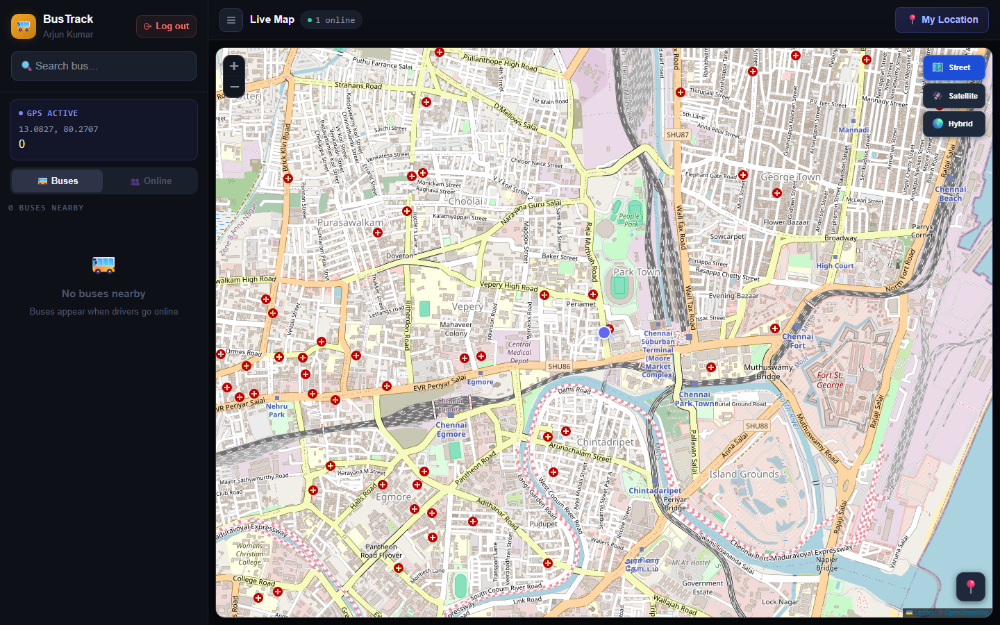
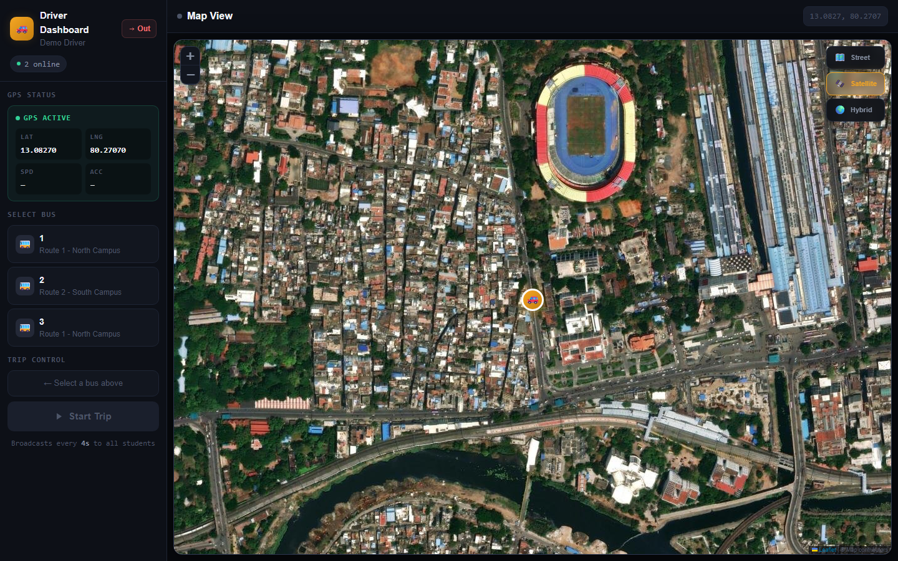
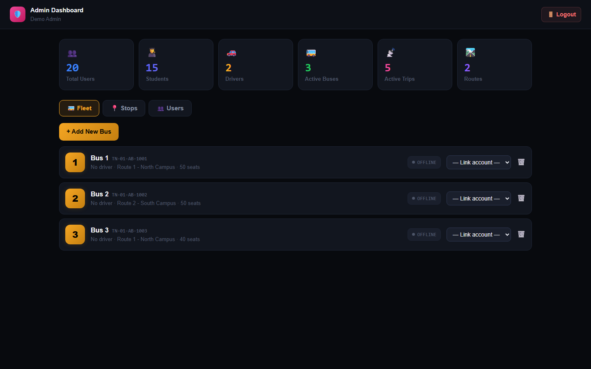
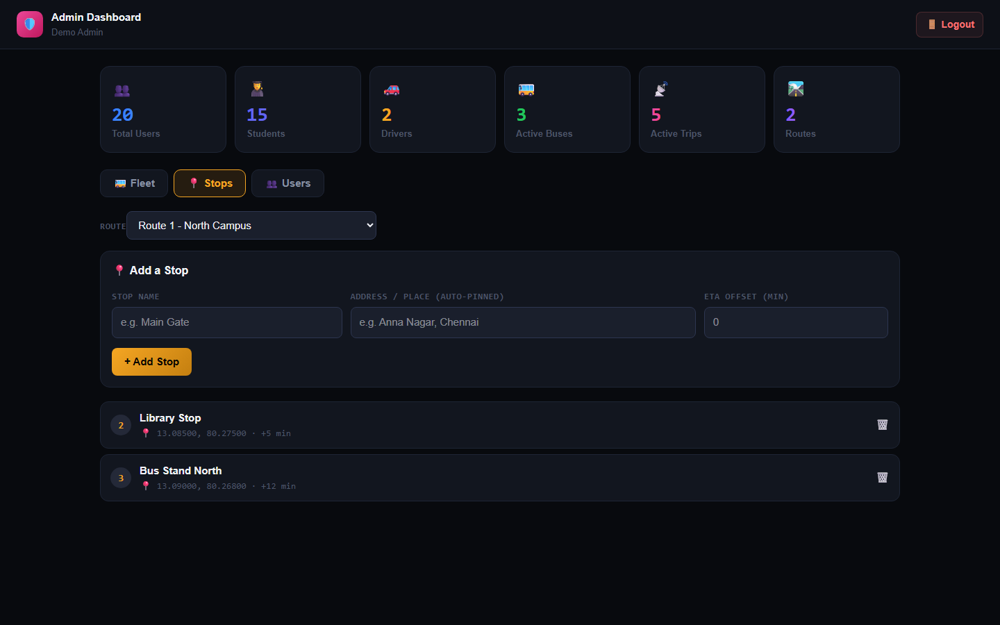
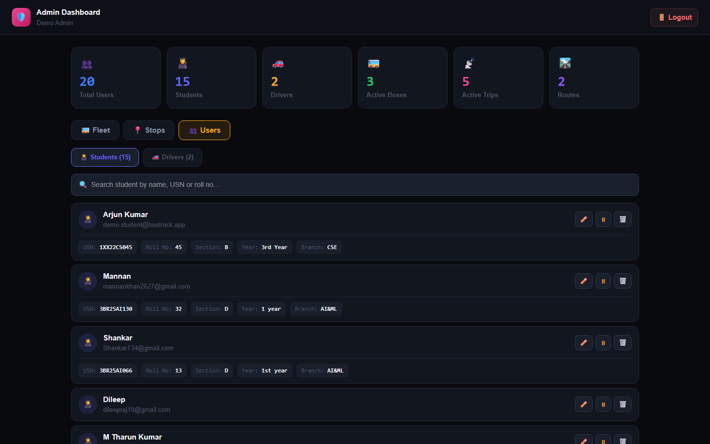
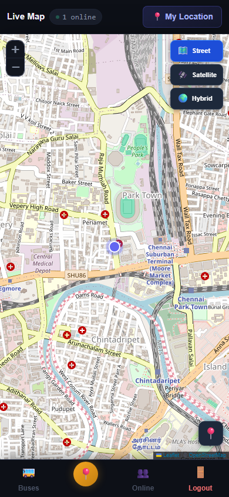

# 🚌 BusTrack — Real-Time College Bus Tracking

**Live App:** **[bus-track-production-ba4e.up.railway.app](https://bus-track-production-ba4e.up.railway.app)**

BusTrack is a real-time college bus tracking **Progressive Web App (PWA)**. Drivers broadcast their live GPS from a phone browser, and students see exactly where their bus is, how fast it's moving, and **when it will arrive** — updated every 4 seconds. It's installable on any phone and works on any network.

> Built with **Node.js · Express · PostgreSQL · Redis · Socket.io · React + Vite · Leaflet**, deployed on **Railway**.

---

## ✨ Key Features

- 📍 **Live GPS tracking** — bus positions update every 4 seconds on an interactive map
- ⏱️ **ETA & arrival time** — see how many minutes until your bus reaches you or a stop
- 🛰️ **Street / Satellite / Hybrid** map views (like Google Maps)
- 🧑‍🎓🚗🛡️ **Three roles** — Student, Driver, and Admin, each with its own dashboard
- 👥 **Multi-device live presence** — see other online users in real time
- 🚏 **Smart stops** — admins add stops by name (auto-pinned to exact coordinates), students get **"bus approaching"** alerts
- 📱 **Installable PWA** — add to home screen, works like a native app
- 🔐 **Secure auth** — JWT tokens with role-based access

---

## 📸 Screenshots

### Sign In
A clean split-screen login. Students, drivers, and admins all sign in here and are routed to the right dashboard automatically.



### Register
Pick a role. Students are asked for their **academic details** (USN, Roll No, Section, Year, Branch); drivers and admins get a simpler form.



### Student Dashboard
A full live map with your location, nearby buses, and a sidebar showing each bus's **speed, ETA, and arrival time**. Switch between Street, Satellite, and Hybrid views.



### Driver Dashboard
The driver picks their bus and taps **Start Trip** — the phone's GPS is then broadcast live to every student. Shows live trip stats (duration, pings sent, speed).



### Admin — Fleet
Live overview of the whole system: total users, students, drivers, active buses, trips, and routes. Each bus shows its **number badge**, number plate, route, LIVE/OFFLINE status, and a driver-assignment dropdown.



### Admin — Stops
Add a stop to any route by typing a place name — the backend **pins the exact location automatically**. Students then see these stops with live ETAs.



### Admin — Users
Users are split into **Students** and **Drivers**, each with a **search bar**. Student cards show full academic details. Admins can edit, deactivate, or delete any user.



### Mobile (PWA)
Fully responsive — on phones the map fills the screen with a bottom navigation bar and slide-up panels.



---

## 🧭 How to Use

### 👨‍🎓 As a Student
1. Open the app → **Register** → choose **Student** → fill in your name, email, password, and academic details (USN, roll no, section, year, branch).
2. **Sign in** — you land on the live map.
3. Allow **location access** when the browser asks (this places you on the map).
4. Browse **nearby buses** in the left panel — each shows **Speed · ETA · Arrival time**.
5. Tap a bus to **track** it; its upcoming stops and ETAs appear, and you get a banner when it's approaching a stop.
6. Use the **🛰️ Satellite** button on the map for a satellite view.

### 🚗 As a Driver
1. **Register** → choose **Driver** (or have an admin link your account to a bus).
2. **Sign in** → the Driver Dashboard opens.
3. **Select your bus** from the list.
4. Allow **location access**, then tap **▶ Start Trip**.
5. Your GPS now broadcasts live every 4 seconds — students tracking your bus see you move in real time.
6. Tap **⏹ End Trip** when you're done.

### 🛡️ As an Admin
1. **Sign in** with an admin account → the Admin Dashboard opens.
2. **Fleet tab** — add buses (with number, plate, driver name & photo), assign drivers, see who's LIVE.
3. **Stops tab** — pick a route and add stops by place name; they're pinned to exact coordinates.
4. **Users tab** — search students or drivers; edit, deactivate, or remove accounts.

### 📲 Install on your phone
Open the live link in your phone's browser → menu → **"Add to Home screen"** / **"Install app"**. It runs full-screen like a native app.

---

## 🏗️ Architecture

```
Driver phone GPS
      │  POST /api/location/update (every 4s)
      ▼
  Express API ──► PostgreSQL   (permanent position history + all data)
      │       └─► Redis        (latest position cache + pub/sub)
      ▼
  Redis pub/sub ──► Socket.io ──► Student maps update live
```

| Layer | Technology |
|-------|------------|
| **Frontend** | React + Vite, React Router, Leaflet maps, Socket.io-client, PWA (service worker) |
| **Backend** | Node.js, Express, Socket.io, JWT auth |
| **Database** | PostgreSQL |
| **Cache / Realtime** | Redis (live positions + pub/sub) |
| **Geocoding** | OpenStreetMap Nominatim (stop pinning) |
| **Hosting** | Railway (app + PostgreSQL + Redis) |

---

## 📁 Project Structure

```
bustrack/
├── backend/                 # Node.js + Express API + Socket.io
│   └── src/
│       ├── config/          # db.js (PostgreSQL), redis.js
│       ├── middleware/      # auth.js (JWT + role guard)
│       ├── routes/          # auth, location, buses, trips, stops, admin
│       ├── socket/          # Socket.io server + Redis pub/sub
│       └── index.js         # entry point (also serves built frontend)
├── frontend/                # React + Vite PWA
│   └── src/
│       ├── pages/           # Login, Register, Student, Driver, Admin
│       ├── components/      # BusMap (Leaflet), etc.
│       ├── lib/             # api.js (axios), socket.js, eta.js
│       └── hooks/           # useMediaQuery (responsive)
├── database/schema.sql      # full schema + seed data
└── docs/screenshots/        # images used in this README
```

---

## 🚀 Run Locally

**Prerequisites:** Node.js 20+, and Docker (for PostgreSQL + Redis).

```bash
# 1. Start PostgreSQL + Redis
docker compose up -d

# 2. Backend
cd backend
npm install
npm run dev            # http://localhost:4000

# 3. Frontend (new terminal)
cd frontend
npm install
npm run dev            # http://localhost:5173
```

The database schema and seed data load automatically from `database/schema.sql` on first start.

---

## 🔑 Demo Accounts (live site)

| Role | Email | Password |
|------|-------|----------|
| Student | `demo.student@bustrack.app` | `Demo@1234` |
| Driver | `demo.driver@bustrack.app` | `Demo@1234` |
| Admin | `demo.admin@bustrack.app` | `Demo@1234` |

---

## 🗺️ Roadmap

- 🔔 Push notifications (Firebase Cloud Messaging) — alerts when the app is closed
- 📥 Bulk student import via Excel/CSV
- 🔑 Password reset + email verification
- 🛣️ Draw road routes on the map
- 📊 Reports & analytics (trip history, on-time %)
- 👪 Parent accounts & boarding attendance

---

*Built as a real-time transit tracking system. Contributions and ideas welcome.*
